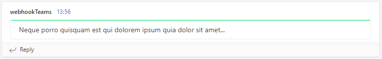
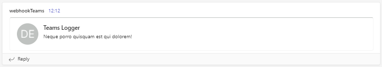
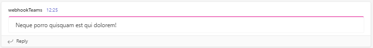
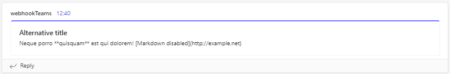
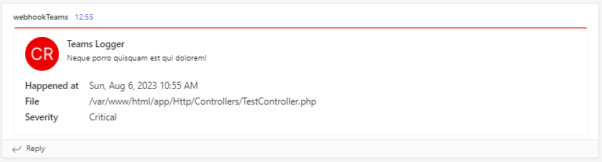
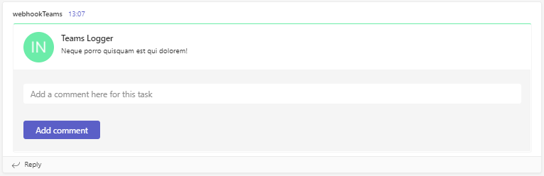
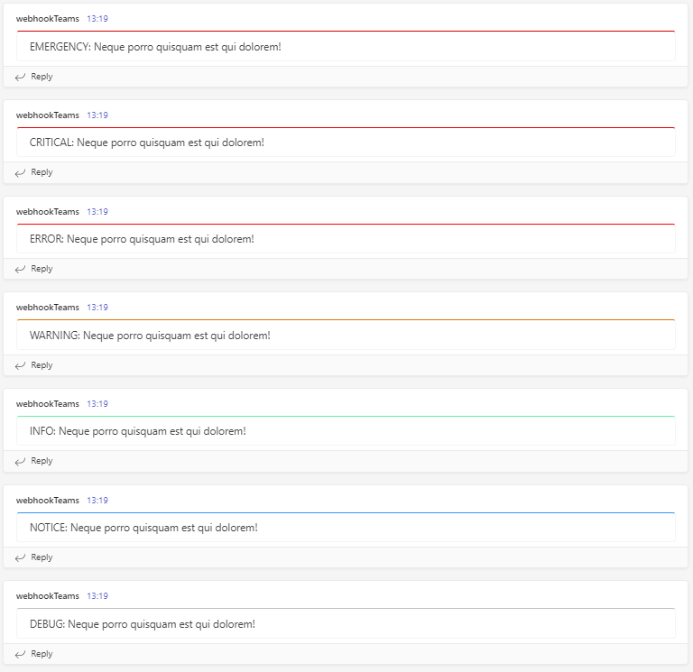
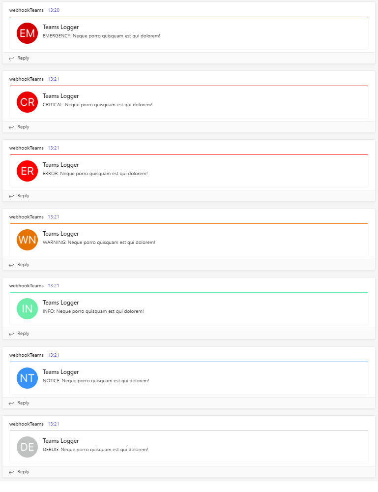

# Laravel Teams Logger

Log handler for Laravel for sending log messages to Microsoft Teams with the  [Teams Incoming Webhook Connector](https://learn.microsoft.com/en-us/microsoftteams/platform/webhooks-and-connectors/how-to/add-incoming-webhook).

**Tested on Laravel 10.x (PHP 8.2, 8.1)**

# Features

* send simple styled log messages  
* send card styled log messages
* include facts in card log messages
* include actions in card log messages
* configurable content and visuals (colors, avatars)


# Installation

Require this package with composer.

```bash
$ composer require kopitar/laravel-teams-logger
```
# Configuration   

After installing the package using composer, create a new [custom channel](https://laravel.com/docs/master/logging#creating-custom-channels-via-factories) in `config/logging.php`:

```php
'teams' => [
    'driver'  => 'custom',
    'via'     => \Kopitar\LaravelTeamsLogger\TeamsLoggerFactory::class,
    'level'   => 'debug',
    'url'     => env('TEAMS_WEBHOOK_URL')
],
```


Copy `teams_logger.php` config file from this package to your Laravel config folder with the following command:

```bash
$ php artisan vendor:publish --tag=teams
```


Add `TEAMS_WEBHOOK_URL` variable to your `.env` file with the URL provided by your Microsoft Teams Connector. (See  [MS Teams Documentation](https://learn.microsoft.com/en-us/microsoftteams/platform/webhooks-and-connectors/how-to/add-incoming-webhook?tabs=dotnet#create-incoming-webhooks-1) for more information on where to get your webhook URL).

There are additional `.env` variables for this package that are optional and have default values. The names of these variables can be found in [`config/teams_logger.php`](src/config/teams_logger.php) and on the list bellow.
These optional `.env` variables provide a way for you to change number of retries, disable avatars, set a default message type etc.


- TEAMS_LOG_NAME (*name of logger, also used as title in card type messages*)
- TEAMS_LOG_TYPE (*sets one of three types of log messages*)
- TEAMS_RETRIES (*number of retries if request to Teams webhook fails*)
- TEAMS_MARKDOWN (*disable or enable markdown in card type messages*)
- TEAMS_AVATAR (*disable or enable avatar image in messages*)

To change colors or avatar images you need to replace the values found for each log level in `config/teams_logger.php`.

# Usage

**Simple type:**

To send a simple style log message to Teams use the following code (assuming `type` is configured to `simple`):

```php
Log::channel('teams')->debug('Neque porro quisquam est qui dolorem!');
```

**Result:**

   

      
**Card type:**

To send a card style log message to Teams use the following code (assuming `type` is configured to `card` and `use_avatar` is set to `true`):

```php
Log::channel('teams')->info('Neque porro quisquam est qui dolorem!');
```

**Result:**




**Json type:**

To send any style log messages to Teams you can also simply use JSON formatted data (assuming `type` is configured to `json`):

```php
Log::channel('teams')->info('{"text":"Neque porro quisquam est qui dolorem!","themeColor":"#df0087"}');
```
This example would produce a simple log message with a `themeColor` of *#df0087*

**Result:**




# Advanced Usage

## 1. Override configuration
Almost any configuration value can be overriden on any log message by defining a new value in the second parameter.
The simplest example would be overriding the `type` setting. If your config says to use *simple type* for your log messages but you want to send a *card type* at a specific place in your code you can do this like in the example below:

```php
Log::channel('teams')->info(
    'Neque porro quisquam est qui dolorem!', ['type' => 'card']
);
```

Other possible configuration overrides are listed in the example below:

```php
Log::channel('teams')->debug(
    'Neque porro **quisquam** est qui dolorem! [Markdown disabled](http://example.net)',
    [
        'type' => 'card',
        'title' => 'Alternative title',
        'themeColor' => '#0000ff',
        'avatar' => false,
        'markdown' => false
    ]
);
```
This sets `type` to '*card*', `activityTitle` to '*Alternative title*', sets the `themeColor` to *blue* and disables *avatar image* and *markdown*.

**Result:**



If sending messages of *simple type* the only config value you are able to override is `themeColor`. Markdown is used by default and cannot be disabled!

```php
Log::channel('teams')->debug('Neque porro **quisquam** est qui dolorem!', ['themeColor' => '#0000ff']);
```

## 2. Facts

When using '*card*' type you can also pass a `facts` parameter which needs to be an array. The contents of this array are then rendered as a *key:value* list in the card message.

```php
Log::channel('teams')->critical(
    'Neque porro quisquam est qui dolorem!',
    [
        'type' => 'card',
        'facts' => [
            'happened at' => now()->toDayDateTimeString(),
            'file' => __FILE__,
            'severity' => 'Critical'
        ],
    ]
);
```
**Result:**




## 3. Actions

When using '*card*' type you can also pass an `actions` parameter which needs to be an array. Actions provide a way for you to include a `potentialAction` property in your message which is an array of actions which add interactive actions in your messages like *adding comments, changing statuses, opening links* etc.

Read [Actions](https://learn.microsoft.com/en-us/outlook/actionable-messages/message-card-reference#actions) documentation on [learn.microsoft.com](https://learn.microsoft.com/en-us) for more information!

```php
        Log::channel('teams')->info("Neque porro quisquam est qui dolorem!", [
           'type' => 'card',
           'actions' => [[
                '@type' => 'ActionCard',
                'name' => 'Add a comment',
                'inputs' => [
                    [
                        '@type' => 'TextInput',
                        'id' => 'comment',
                        'isMultiline' => false,
                        'title' => 'Add a comment here for this task'
                    ]
                ],
                'actions' => [
                    [
                        '@type' => 'HttpPOST',
                        'name' => 'Add comment',
                        'target' => 'https =>//learn.microsoft.com/outlook/actionable-messages'
                    ]
                ],
            ]]
        ]);
```

**Result:**



# Preview (simple type)



# Preview (card type)



# Changelog

Please see [CHANGELOG](CHANGELOG.md) for more information on what has changed recently.

# License

This laravel-teams-logging package is available under the MIT license. See [LICENSE.md](LICENSE.md) file for more info.